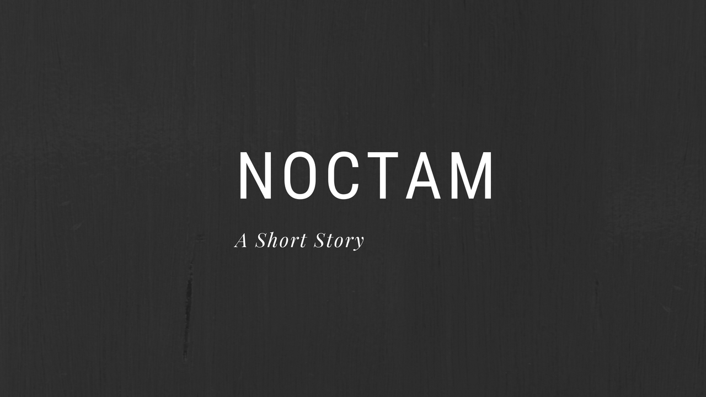

<h1>Noctam - A Short Story</h1>
<h3>Scernario Designer/Writer &amp; Developer - Nikki Xaysanasy</h3>
<h3>Engine: Ren'Py</h3>

    <h3>News</h3>
    <ul>
                <li>
    <em>August 25, 2018</em>
    

    I have just started the layout of the game and been writing the script as I go. I have written the concept and know how the story goes and how it will end. It is a Horror Visual Novel game in the vein of Higurashi and Umineko (Which inspired this project by the way).
    This project is designed to be the prologue to an upcoming survival horror game that I will be co-developing with a small team. This visual novel will be short and can be finished in less than a day.

    
Here's a quick snippet of what I have so far. I will be using images/sounds/music from open source communities.

    
</li>

<h3>Project Timeline</h3>
<ul>

TBD

</ul>